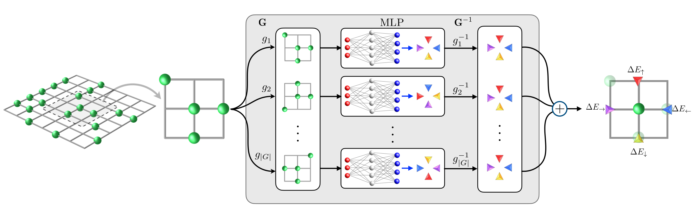
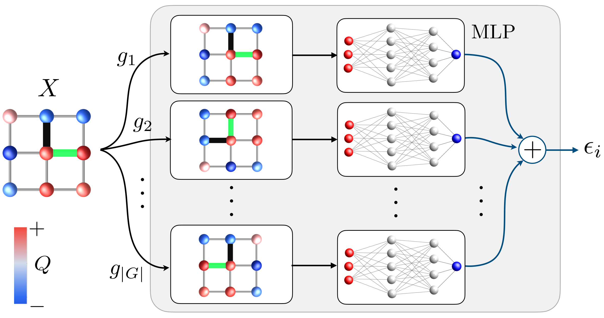

# Invariant and Equivariant Neural Networks by Group Averaging

This repository shows, in two short PyTorch programs, how an ordinary neural
network can be made exactly invariant or equivariant under the eight rotations
and reflections of a square (the group $D_4$).

Both introductory programs use a $3\times3$ patch of scalar lattice values,
matching the type of input used in the manuscript. The equivariant example
produces four directional scalar outputs that are permuted by $D_4$; the input
is not treated as a geometric vector.

## The two manuscript examples

### Falicov-Kimball: equivariant directional outputs

[](figures/fk_schematic.pdf)

The local configuration is symmetry-transformed, evaluated by the same
ordinary MLP, returned to the original output frame, and averaged. The four
outputs are the directional energy changes.

### Holstein: invariant local energy

[](figures/holstein_schematic.pdf)

The transformed displacement patches are evaluated by the same ordinary MLP
and averaged to obtain the invariant local energy $\epsilon_i$.

## The whole idea

Start with any neural network $f$ and average over the symmetry group $G$.

For a scalar invariant output,

$$
f_{\mathrm{inv}}(x)=\frac{1}{|G|}\sum_{g\in G}f(gx).
$$

For a vector equivariant output, first bring every prediction back to the
original coordinate frame,

$$
f_{\mathrm{eq}}(x)=\frac{1}{|G|}\sum_{g\in G}g^{-1}f(gx).
$$

```text
transform input  ->  ordinary neural network  ->  align output  ->  average
```

That is the complete construction. No specialized equivariant neural-network
layers are required.

## Run without knowing Git

1. Sign in to GitHub and open this repository.
2. Click the green **Code** button, then **Download ZIP**.
3. Unzip the downloaded file and open a terminal in that folder.
4. Run:

```bash
python -m pip install -r requirements.txt
python invariant.py
python equivariant.py
```

Alternatively, use **Code -> Codespaces -> Create codespace on main** on the
GitHub page. In the Codespaces terminal, run the same three commands.

## Run with Git

```bash
git clone https://github.com/naraguho/equivariant-projection-networks.git
cd equivariant-projection-networks
python -m pip install -r requirements.txt
python invariant.py
python equivariant.py
```

Each program constructs a small, randomly initialized ordinary MLP and checks
all eight elements of $D_4$. The reported symmetry errors should be close to
machine precision:

```text
largest invariance error:  1e-16
largest equivariance error: 1e-16
```

The examples do not require training data or a GPU.

## Run the training examples

Starting from a terminal, clone the repository and run one command:

```bash
git clone https://github.com/naraguho/equivariant-projection-networks.git
cd equivariant-projection-networks
bash run_training.sh
```

The script creates a Python virtual environment, installs the required
packages, and trains both manuscript models for one epoch using the included
real-data samples. It also writes the validation ED-versus-ML $y=x$ plots.

For a longer example, set the number of epochs:

```bash
EPOCHS=10 bash run_training.sh
```

Results are saved under `manuscript/outputs/fk/` and
`manuscript/outputs/holstein/`.

## Files to read

- [`invariant.py`](invariant.py): scalar group averaging in one file.
- [`equivariant.py`](equivariant.py): vector group averaging in one file.
- [`manuscript/`](manuscript/): optional FK/Holstein training, data, notebooks,
  and correlation-function benchmarks used for the manuscript.

## Citation

If this example is useful, please cite:

```bibtex
@article{jang2026equivariant,
  title   = {Exact Equivariance from Ordinary Neural Networks for
             Lattice Many-Body Dynamics},
  author  = {Jang, Ho and collaborators},
  journal = {arXiv preprint arXiv:2609.XXXXX},
  year    = {2026}
}
```

`2609.XXXXX` is a temporary placeholder and should be replaced when the
manuscript receives its arXiv identifier.

## License

MIT
