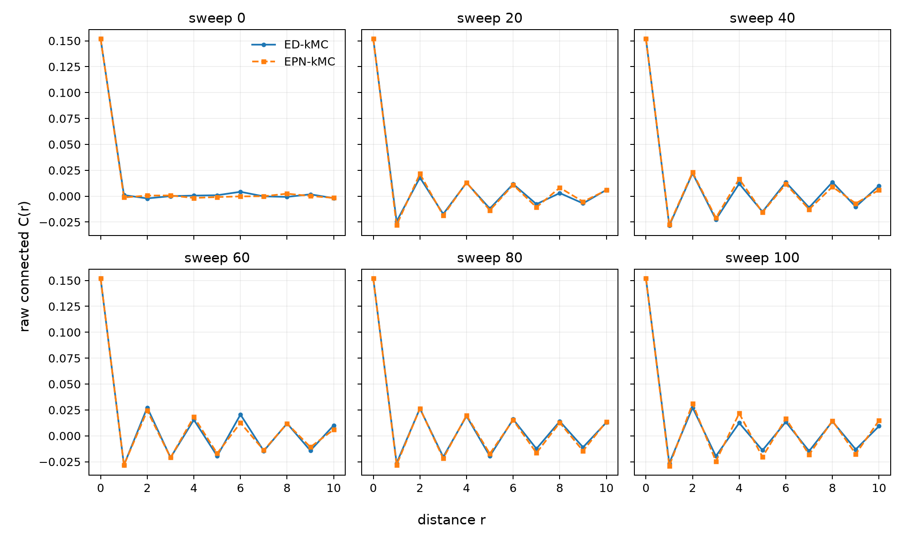
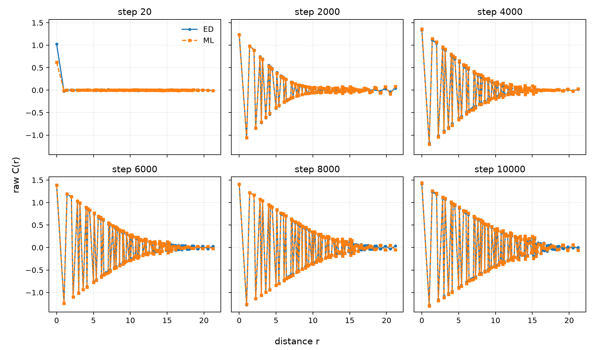

# Manuscript material

This directory contains the full FK and Holstein research workflow. It is not
needed for the two introductory examples in the repository root.

## Contents

- `epn/`: reusable $D_4$ transformations and projection models.
- `examples/`: manuscript-sized model demonstrations.
- `training/`: FK and Holstein training programs.
- `benchmarks/`: saved ED-versus-ML and correlation-collapse plots.
- `notebooks/`: the visual tutorial with rendered outputs.
- `scripts/`: dataset download and notebook-generation utilities.
- `tests/`: numerical symmetry tests.
- `DATASETS.md`: data provenance, splits, formats, and checksums.
- `MODELS.md`: manuscript network dimensions.

## Install and test

From this directory:

```bash
python -m pip install -e ".[dev]"
pytest
```

For the simplest end-to-end sample training, run this from the repository
root:

```bash
bash run_training.sh
```

The full datasets and trained checkpoints remain in the GitHub release rather
than in the Git repository. See `DATASETS.md` for download instructions.

## Validation against ED

Both training programs save a direct validation comparison after the final
epoch:

```text
outputs/fk/validation_ed_vs_ml.png         ED Delta F versus ML Delta F
outputs/holstein/validation_ed_vs_ml.png  ED force versus conservative ML force
```

The dashed diagonal is $y=x$. Only held-out validation trajectories are used.

The real dynamical correlation comparisons are shown below. These use ED
trajectories and independent trajectories generated with the trained ML model;
they are not training-label comparisons.

### Falicov-Kimball correlation validation



### Holstein correlation validation



To regenerate both figures from the released data:

```bash
python scripts/download_data.py manuscript_benchmarks.zip --extract
python benchmarks/plot_saved_benchmarks.py
```
